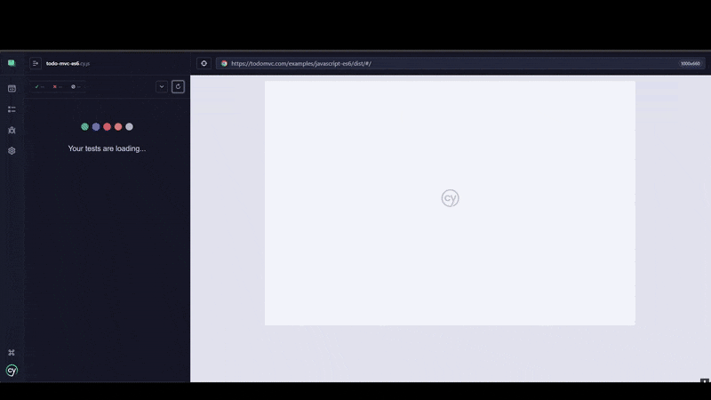

# ✅ TodoMVC ES6 - Cypress Automated Tests

This project contains automated end-to-end tests for the **TodoMVC ES6** application using [Cypress](https://www.cypress.io/).  
It covers the core functionality of the TodoMVC app — creating todos, editing, deleting, toggling, filtering, and using the **toggle all** feature.

## 🎥 Demo

Here’s a quick demonstration of the Cypress tests running against the TodoMVC ES6 app:

  

---  
## 🧪 Test Suite Overview  

- **creates and completes multiple todos**    
Verifies adding todos, toggling them as completed, and filtering to show completed items.  

- **creates and edits a todo, toggles it, and shows active todo**   
Covers editing a todo, marking it as completed, and verifying only active todos are shown.  

- **creates, deletes, toggles, and filters todos with toggle-all functionality**   
Ensures deleting, toggling, navigating between filters, and completing all with toggle-all works correctly.  

## 📌 Features Tested

- Adding multiple todos
- Marking todos as completed
- Editing existing todos
- Filtering todos by **Active** / **Completed**
- Deleting todos
- Using the **Toggle All** option

---

## 🛠️ Setup & Installation

1. Clone the repository:
   ```bash
   git clone https://github.com/your-username/todomvc-es6-tests.git
   cd todomvc-es6-tests
   ```
2. Install dependencies:
  ```bash
  npm install
  ```

3. Run cypress:
  ```bash
  npx cypress open
  ```
OR run test headlessly:
  ```bash
  npx cypress run
  ```


